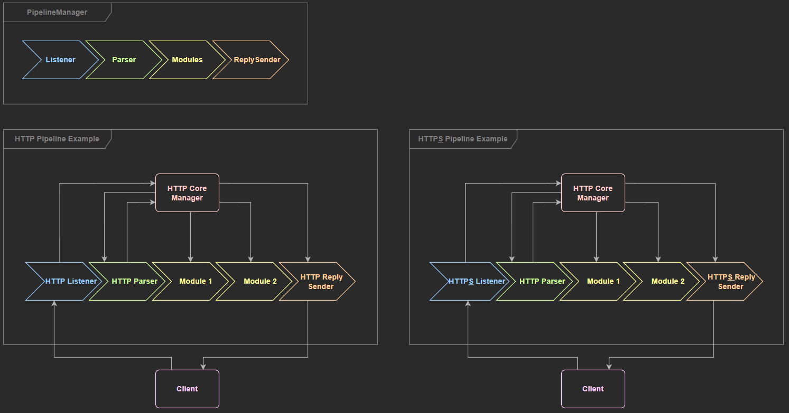

# Ziapi

## Summary
 * [Introduction](#Introduction)
 * [Installation](#Installation)

## Introduction

This API uses both composition and inheritance to provide a generic way to set up
a custom server with a custom communication protocol and custom middlewares.

You can for instance put an HTTP server as well as an FTP or SMTP one.
Here is a small overview of how a pipeline works:

- Setup phase
    - The `PipelineManager` contains an instance of the `Listener`, `PacketParser`, `ReplySender` and a vector of all
      `Modules` used by the pipeline.
    - The `PipelineManager` will send it's `processRequest()` method as a callback to the `onPacket()` method of the
      listener
    - When the `listen()` method of the `Listener` is called, the `Listener` starts listen for new packets.

- Processing phase
    - When the `Listener` receives a full packet, it just calls corresponding callback (the `processRequest()` method from the
      `PipelineManager`)
    - The `PipelineManager` will then call the `PacketParser`, giving it the raw request. The `PacketParser` will return
      the parsed request.
    - The `PipelineManager` will next call each `Module` in the order they have been registered with the parsed request
      and a blank response. The modules will then mutate the request and/or the response.
    - When all modules are called, the `PipelineManager` will call the reply sender to send back the reply to the client.

Pipeline request workflow:

*note that the only difference http and https pipeline is the listener as the pipeline is extremely modular*

## Installation

There are two ways to install the API.

### First way:
* create a `cmake/` folder at the root of your project
* copy the [FindZiapi.cmake](FindZiapi.cmake) and paste it in the cmake folder.
* add `set(CMAKE_MODULE_PATH "${CMAKE_CURRENT_LIST_DIR}/cmake")` in the root CMakeLists.txt
* add `find_package(ziapi)` in the root CMakeLists.txt
* Use `target_link_libraries()` with the target and the `ziapi` target to link the headers with all targets that will
  need it

With this procedure, CMake will automatically clone the repository in your cmake build folder
and update it everytime there is an update on the API.

Example:

cmake:
```cmake
add_subdirectory(ziapi)

find_package(ziapi)

add_executable(
    zia
        src/main.cpp
)

target_link_libraries(
    zia
        ziapi
        # Add other libs here
)
```

### Second way:
* Clone the repository in your project
* Use `add_subdirectory()` in your CMakeLists.txt with, as parameter the path to the cloned folder.
* Use `target_link_libraries()` with the target and the `ziapi` target to link the headers with all targets that will
  need it.

Example:

shell:
```shell
git clone https://github.com/aurelien-boch/ziapi
```
cmake:
```cmake
add_subdirectory(ziapi)

add_executable(
    zia
        src/main.cpp
)

target_link_libraries(
    zia
        ziapi
        # Add other libs here
)
```
